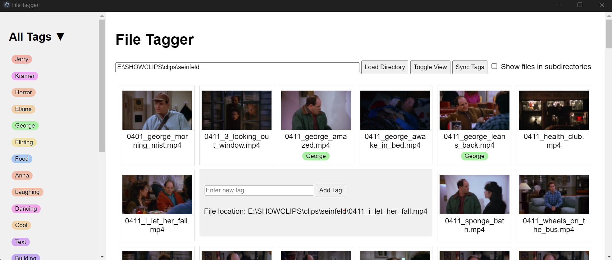

# File Tagger

Very very simple windows file tagger.



## Build Process

### Install

Clone the repo and install dependencies

```
git clone https://github.com/JahsiasWhite/file-tagger
cd file-tagger
npm install
```

### Run

Inside the project's root directory, enter `npm start`
